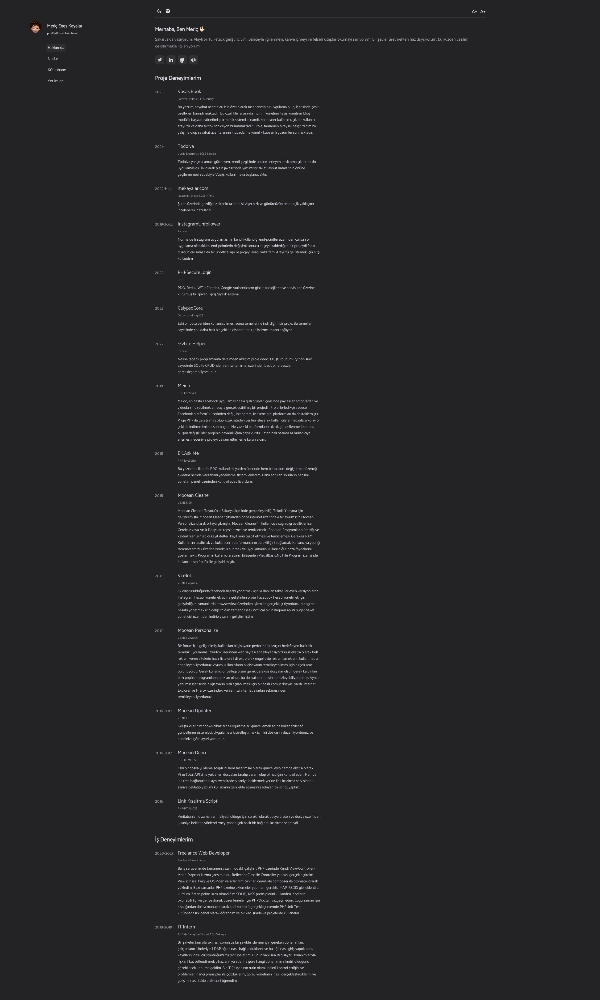
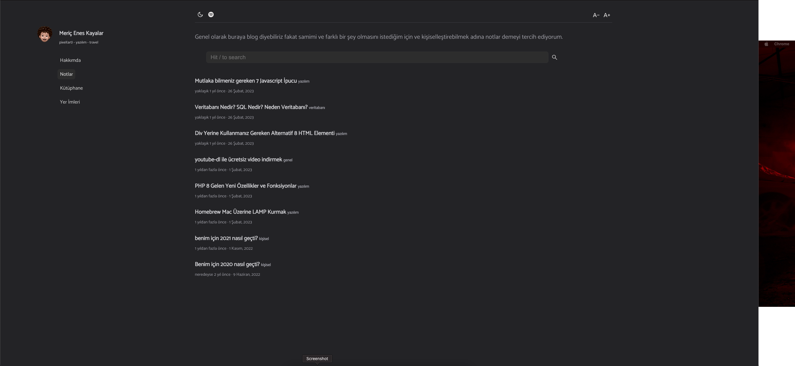
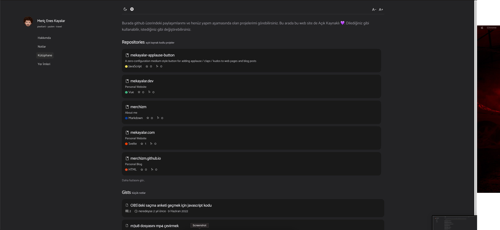

# mekayalar.com | [for TURKISH](README_TR.md)

In this repository, you can find the code that runs on [mekayalar.com](mekayalar.com). This software is hosted on [Vercel](https://vercel.com).

## Development Process for 1.0 Version

- [ ] English language support
- [ ] New component for skillset in the "About me" section
- [ ] ~~Turn off/disable tooltips in mobile view~~
  - I don't think I can find a way to do this.
- [x] ~~Write search module for Notes section~~
- [x] ~~Finish module for saving posts offline~~
- [x] ~~Review and improve styles on Note page~~
- [x] ~~Finish Bionic Reader module~~

## Planned Developments

- Dynamic CV, CV that changes based on the software languages you write
- Availability check via calendar
- maybe a module for making appointments
- detailed modal or page for projects
- prevent screen from sleeping on article page
- sharing buttons/menu for articles
- ~~fix to prevent screen saver from showing the same goodbye repeatedly~~

## Installation

The installation is quite simple, first clone the repository:

```bash
git clone https://github.com/merchizm/mekayalar.com.git
```

After cloning, install the required modules:

```bash
npm install
```

After installing your modules, create a `.env` file in the main directory, with the following contents:

- VITE_RAINDROP_ACCESS_TOKEN = your [Raindrop.io](https://developer.raindrop.io/v1/authentication/token) API token,
- repo information you will receive from [Giscus](https://giscus.app/),
  - VITE_GISCUS_CATEGORY_ID = your category ID,
  - VITE_GISCUS_REPO_ID = your repo ID
- VITE_GH_TOKEN = your [GitHub API](https://docs.github.com/en/rest) token

After creating your `.env` file, you need to customize the `src/lib/siteConfig.js` file to your needs. After customization, you can run the project: (I forgot the Spotify API, you can get that from [here](https://github.com/merchizm/mekayalar.com-spotify-api))

```bash
npm run dev
## for production
npm run build
## for preview after first build
npm run preview
```

## Screenshots




## Thanks

Special thanks to [Zeynep](https://github.com/zynpnaz) for helping me develop this project.
